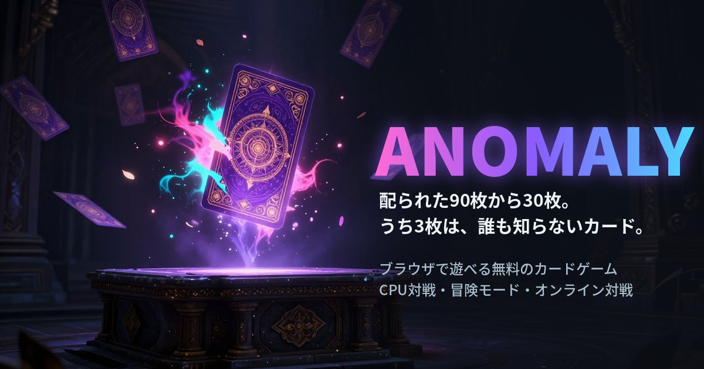

# ANOMALY

**配られた90枚から30枚。うち3枚は、誰も知らないカード。**

ブラウザで遊べる、1人〜2人用のデジタルカードゲームです。インストール不要、スマホでもパソコンでも遊べます。

### ▶ [いますぐ遊ぶ](https://sho2net.github.io/anomaly/)

## どんなゲーム？

- 毎回ランダムに90枚のカードが配られ、その中から30枚のデッキを組んで戦います。同じデッキは二度とできません。
- 90枚のうち3枚は、その場で生まれる **アノマリー**。効果は試合ごとに違い、相手はあなたが使うまで中身を知りません。
- 属性は炎・水・森・光・闇の5つ。メイン属性を1つ選び、属性ごとのリーダー能力と得意な戦い方で戦います。
- エナジーは毎ターン自動で1ずつ増えるので、「カードが出せないまま負ける」ことが起きにくくなっています。
- 相手のライフを0にしたら勝ちです。

## 遊び方いろいろ

| モード | 内容 |
|---|---|
| チュートリアル | 案内つきの練習試合。初めての方はここから |
| 新しい対戦 | CPU（弱・中・強）と2本先取／3本先取。デッキはおまかせでも組めます |
| デイリーチャレンジ | 毎日、全員が同じ90枚・同じ相手・同じ「今日のルール」で1本勝負。ランキングあり |
| 冒険モード | 1人用の旅。戦いながらカードや秘宝を集め、最後の敵を目指します（ハードもあり） |
| ボスに挑戦 | 特別なルールを持つボスと1本勝負 |
| オンライン対戦 | 4文字の部屋コードで、離れた友だちと対戦 |
| カードリスト | 全231種のカードを見られる図鑑 |

## 感想・不具合の報告

遊んでみた感想や、おかしな動きを見つけたときは、[感想フォーム](https://docs.google.com/forms/d/e/1FAIpQLSfKUo5kzEdt_iXIYET5lnLlq6bxc6guSZX1QwjqpYe0vuZwZQ/viewform) から気軽に送ってください（ゲームのタイトル画面からも開けます）。

## 補足

- 進み具合はブラウザに保存されます。別の端末に移すときは、タイトル画面の「データの引き継ぎ」を使ってください。
- 個人で作っている試作品です。バランスは遊んでもらった声をもとに調整を続けています。
